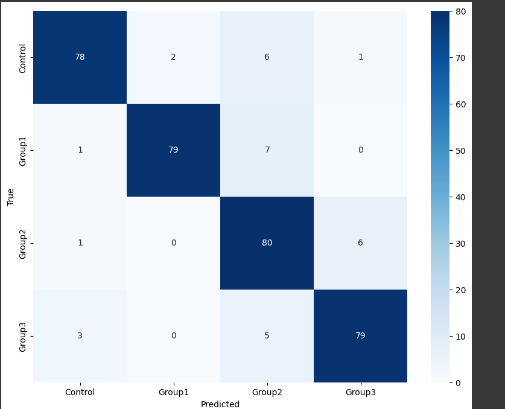
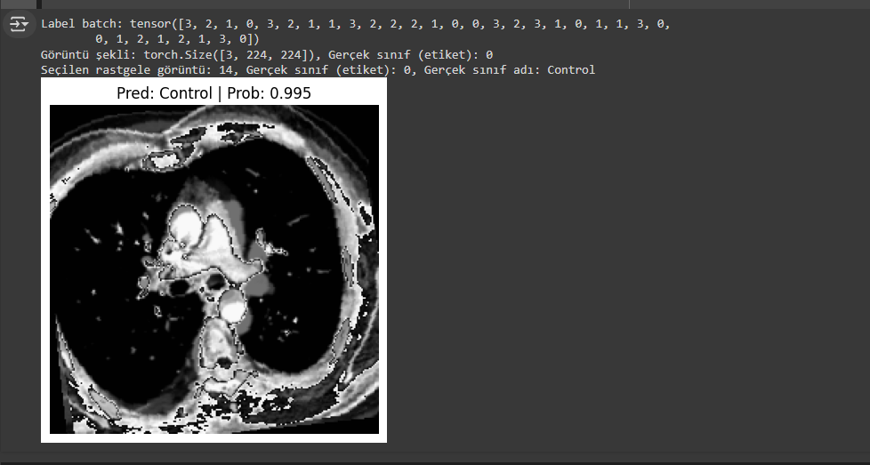

# Pulmonary Hypertension Detection

This repository contains the implementation of a Vision Transformer (ViT) model for the detection of pulmonary hypertension

## Table of Contents

1. [Introduction](#introduction)
2. [Dataset](#dataset)
3. [Preprocessing](#preprocessing)
4. [Model Architecture](#model-architecture)
5. [Training](#training)
6. [Evaluation](#evaluation)
7. [Results](#results)
8. [Benefits](#benefits)
9. [Challenges](#challenges)
10. [Conclusion](#conclusion)
11. [Contact](#contact)
12. [License](#license)

## Introduction

Pulmonary hypertension (PH) is a severe condition characterized by high blood pressure in the lungs' arteries. Early detection is crucial for effective treatment. This project aims to develop a robust and accurate model for detecting PH using medical images and Vision Transformer (ViT) architecture.

## Dataset

The dataset used in this project was collected from Firat University Hospital Cardiology Clinic. It includes 807 transverse contrast-enhanced computed tomography (CT) images of 313 patients, collected between 01/01/2016 and 31/12/2022. The images and relevant clinical records have been retrospectively analyzed and approved by the hospital's ethics committee. Patients are divided into four groups based on the mean pulmonary artery pressure (mPAP) measured by invasive right heart catheterization:

- **Control:** Patients with mPAP less than 20 mmHg.
- **Group 1:** Patients with mPAP between 20 and 25 mmHg.
- **Group 2:** Patients with mPAP between 25 and 30 mmHg.
- **Group 3:** Patients with mPAP above 30 mmHg.

### Data Distribution

- **Training Set:**
  - 158 images for Control
  - 60 images for Group 1
  - 101 images for Group 2
  - 290 images for Group 3
- **Test Set:**
  - 52 images for Control
  - 20 images for Group 1
  - 29 images for Group 2
  - 97 images for Group 3

## Preprocessing

To ensure the model receives standardized input, the following preprocessing steps were applied:

- **Image Resizing:** Images were resized to 224x224 pixels.
- **Data Augmentation:** Applied random rotation, flipping, color jitter, Gaussian blur, and coarse dropout to enhance model generalization.
- **Normalization:** Images were normalized to have a mean of 0.5 and standard deviation of 0.5.
- **SMOTE:** Used Synthetic Minority Over-sampling Technique (SMOTE) to handle data imbalance.

## Model Architecture

We utilized the Vision Transformer (ViT) model due to its effectiveness in image classification tasks. The model was fine-tuned on our dataset with the following configuration:

- **Pretrained Weights:** ViT_B_16_Weights.DEFAULT from Torchvision.
- **Modifications:** Added a dropout layer and a fully connected layer to adjust for the number of classes in our dataset.

## Training

### Hyperparameters

- **Optimizer:** AdamW with a learning rate of 0.001 and weight decay of 0.01.
- **Loss Function:** CrossEntropyLoss with class weights to handle class imbalance.
- **Scheduler:** OneCycleLR to adjust the learning rate dynamically during training.
- **Batch Size:** 32
- **Epochs:** 150

### Training Process

The training was conducted on a GPU-enabled environment to speed up the process. The model was trained using the training dataset and validated on a separate validation set extracted from the training data. The dataset was split into 70% training and 30% test data to evaluate the model's performance accurately.

## Evaluation

The model was evaluated using the test dataset, and the following metrics were used to assess performance:

- **Accuracy:** Overall correctness of the model.
- **Confusion Matrix:** To visualize the classification performance across different classes.
- **Loss Curves:** To monitor training and validation loss over epochs.

## Results

The model achieved a validation accuracy of 93.10%. Below are the detailed results:

- **Confusion Matrix:**

- 
  
- **Sample:**
- 
  

## Benefits

- **Early Detection:** Enables timely intervention and treatment for pulmonary hypertension.
- **High Accuracy:** The model's high validation accuracy ensures reliable predictions.
- **Scalability:** The approach can be scaled to larger datasets and other medical imaging tasks.

## Challenges

- **Data Imbalance:** Handling class imbalance was crucial to improve model performance.
- **Computational Resources:** Training large models like ViT requires significant computational power.

## Conclusion

This project demonstrates the potential of Vision Transformers in medical image classification, specifically for detecting pulmonary hypertension. The high accuracy achieved indicates that ViT is a promising architecture for such tasks.

## Contact

For any questions or collaboration, please contact:

- Email: erdemaslan1905s@gmail.com

## License

This project is licensed under the MIT License - see the [LICENSE](LICENSE) file for details.
